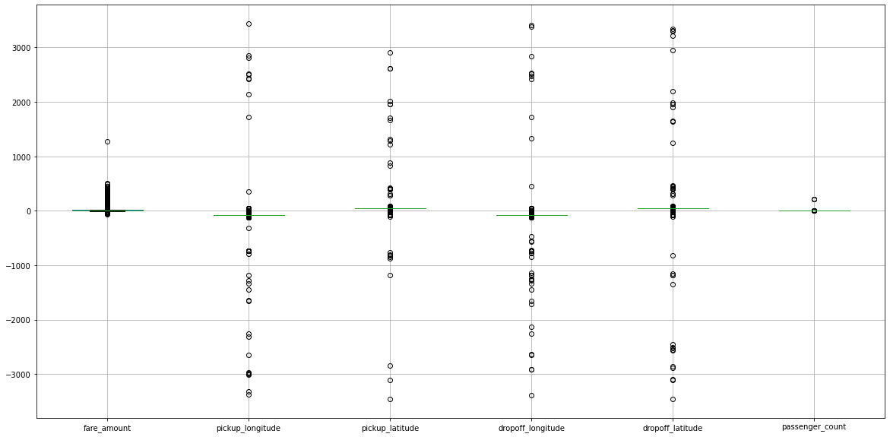
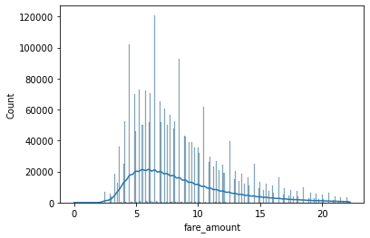
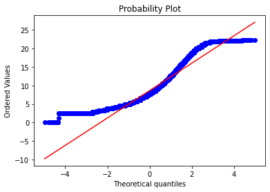
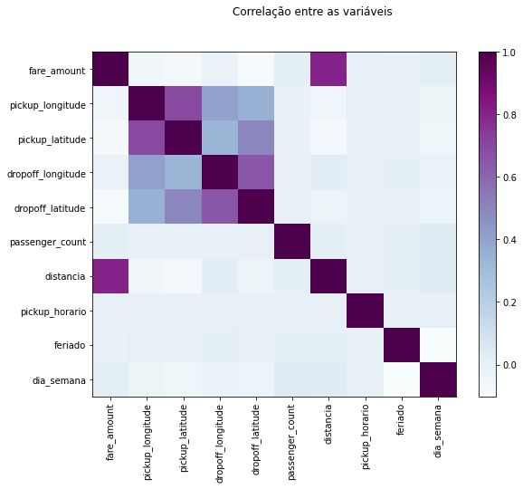
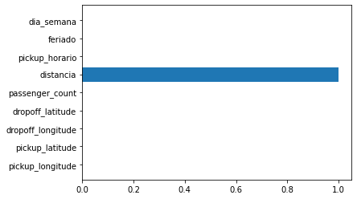
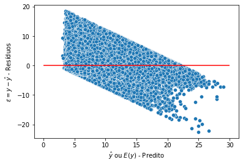
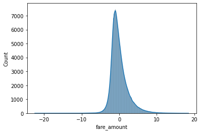

# New York City Taxi Fare Prediction

Este projeto faz uma análise dos dados disponíveis no Kaggle para previsão de corridas de taxi na cidade de Nova York.

Fonte: https://www.kaggle.com/c/new-york-city-taxi-fare-prediction/overview

### Obtenção dos dados

Utilizei a API do Kaggle para fazer *download* (ref. https://www.kaggle.com/docs/api).

### Limpeza e tratamento dos dados

- Análise dos tipos de dados:
- - **pickup_datetime**: Observando a coluna 'pickup_datetime' e pela própria descrição do dataset, a coluna deveria ser no formato data. Ao tentar apenas converter, da erro por conta do 'UTC' no fim da string da data, necessário ajustar.
- - **passenger_count**: Lida como float, o ideal seria tê-la como integer. Nota-se que há tipos NaN (será tratado na etapa de tratamento de NaN) e por essa razão, a coluna foi lida como float. Após o tramento de NaNs, será realizada a conversão para int.

- Análise e tratamento de dados faltantes:
- - Existem algumas observações com dados faltantes e foi optado por removê-las pois em todas as observações o local de destino está como NaN.
- - Alguns problemas podem ter gerado esses dados como, falha no processo de coleta de dados, erro no aplicativo que coletava os dados, etc.

- Análise e tramento de *outliers*
- - Visualização de boxplots, para identificar quais colunas possuem possíveis *oultliers* de forma visual

- - Análise dos *outliers* de cada atributo;
- - - **longitude e latitude**: nota-se tanto pelo boxplot, quanto pelas estatísticas descritivas que os valores de latitude e longitude estão ou muito acima, ou muito abaixo do esperado. As observações fora dos intervalores serão excluídas do conjunto de dados pois, são informações que a principio não há como tratar. Os valores de latitude e longitude são validos se: Latitude = [-90, +90] e Longitude = [-180, +180]. Para melhorar essa validação, uma vez que a base é da cidade de NY, poderia ser utilizada API do google por exemplo para verificar se as coordenadas de cada observação é válida. Como há observações com 0 nas colunas de **latitude e longitude**, importante fazer a análise desse cenário também. Há bastante linhas (aproximadamente 1% do total de observações do dataset) com **latitude e longitude zeradas**. Este local de coordenadas [0, 0] não está localizado na cidade de NY, por essa razão é necessário fazer algum tipo de tratamento. Uma possibilidade é estimar esses parâmetros a partir de outros, fazendo a previsão e preechendo essas observações. Acredito que devido a caracteristica dos atributos que temos (passageiro, valor e data/hora) não parecem bons para estimar as coordenadas de partida e chegada.
- - - **passenger_count**: o boxplot mostra alguns pontos fora do esperado para a coluna de passageiro:
- - - - Observações com 0 serão mantidas pois, a principio pode ser entrega de algum item e não tem passageiro;
- - - - Observações com 208 serão removidas pois latitude e longitude estão iguais a 0;
- - - - Há apenas uma observações com 9 passageiros, ela será mantida pois pode ser uma van, etc.
- - Remoção de *outliers* de acordo com método IQR.

#### Data Exploration
#### Correlação de Pearson
Análise da correlação entre as variáveis, para ver se existe redundância de colunas ou fortes associações (positivas ou negativas). As coordenadas tem associação negativa com o preço, apesar de não serem valores muito altos.

#### Criação de colunas que podem ser importantes para a predição de amount
- **Distancia**: Uma opção que pode facilitar na análise é calcular a **distância** entre as coordenadas de partida e chegada. O valor não irá corresponder exatamente à distancia percorrida pelo taxi, afinal podem ter vários caminhos para chegar de um ponto ao outro mas, será uma medida aproximada que pode ajudar com a previsão. É de consenso que a distancia pode influenciar o valor de uma corrida de taxi.
- **Horário do dia**: os preços podem variar de acordo com o horário de acordo com o site de NY (https://www1.nyc.gov/site/tlc/passengers/taxi-fare.page#:~:text=%242.50%20initial%20charge.,Dutchess%2C%20Orange%20or%20Putnam%20Counties). Uma coluna será criada para o horário, mantendo como unidade os minutos.
- **dia_semana** e **feriado**: No site também é falado que há diferenças quando é um dia da semana e quando é dia da semana mas também é feriado. Devido à essas informações serão utilizadas mais duas colunas: dia_semana e feriado, ambas com binárias.

Após a criação de novas colunas, é possível ver que **distância** apareceu como um atributo com alta correlação positiva com **fare_amount**. Neste caso, como é de senso comum sabemos que de fato a distância impacta nos preços. Mas, é importante ressaltar que correlação não significa necessariamente causalidade.

- Exploração da distribuição da variável target (fare_amount)

## Models
### Random Forest Regressor
#### Features Importance

### Multiple Linear Regression
#### Residual Analysis

